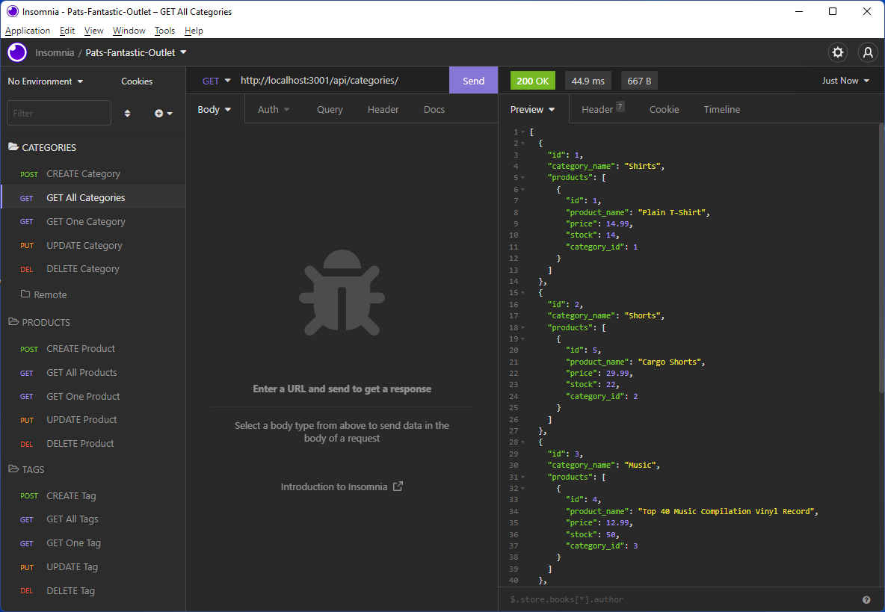

# Pat's Fantastic Outlet

## Description

  - The backend for an e-commerce site that sells just about anything, as long as it's fantastic!
  - E-commerce is a big business and it is important for developers to know how to build sites that allow businesses to sell products online.
  - I wanted to take my development to the next level and work on an e-commerce project because that is something I would likely work on in my career as a web developer.
  - This project exposes APIs you can use to manage Products, Categories and Tags. You can group Products in Categories and tag Products with Tags.
  - I learned how to the Sequelize to interact with a MySQL database. What was most impressive about Sequelize to me is how easy it is to manage the One-to-Many and Many-to-Many relationships.

## Table of Contents

  - [Installation](#installation)
  - [Usage](#usage)
  - [License](#license)
  - [Contributing](#contributing)
  
  - [Questions](#questions)

## Installation

  - git clone https://github.com/patrickaregan/pats-fantastic-outlet.git
  - *You must have MySQL installed on your machine to use this application.*

## Usage

  1. In the root directory run "npm i" to install dependencies.
  2. Run "npm start" to create the database and sync with the models in the application.
  3. Stop the server so you can seed the database.
  4. Run "npm run seed" to seed the database.
  5. Run "npm start" to start the server again.
  6. Watch the demo video below to see how to use the APIs.

  
  - [Demo video 1](https://drive.google.com/file/d/11uYMFEDZjwnIVGKLU9anl3kVELK9RtM_/view)
  - [Demo video 2](https://drive.google.com/file/d/1sMILO7LYFD71Q0qEyXhPC-u2xT17Y06O/view)

## License

  - MIT

## Contributing

  - My contribution rule is to treat others with respect and if you see any violations please contact me at my email below.  
  

## Questions

- [GitHub Profile](https://github.com/patrickaregan)
- If you have additional questions please email me at patrickaregan@gmail.com

